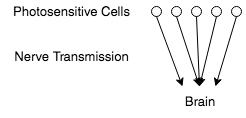
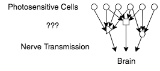
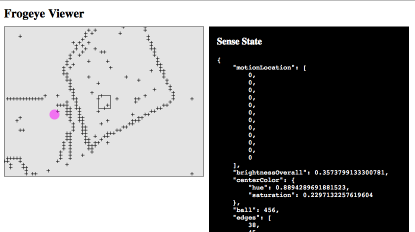
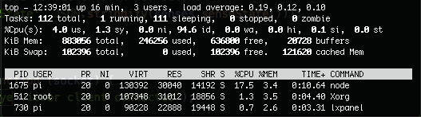

#  frogeye.js

I discovered the seminal 1959 paper "[What a Frog's Eye Tells a Frog's Brain](http://neuromajor.ucr.edu/courses/WhatTheFrogsEyeTellsTheFrogsBrain.pdf)" in a [article on Walter Pitts](http://nautil.us/issue/21/information/the-man-who-tried-to-redeem-the-world-with-logic)

Mind == Blown.

Not only was Walter a fascinating person, but the results of the frog eye study jibed with [my own work on AI](http://behaviorallogic.com/foundation). The powerful simplicity of image processing in a frog's retina inspired me to build a similar type of image processor.

## What Does a Frog's Eye Tell a Frog's Brain?

The gist of the paper is that most people probably think that the vertebrate eye works like a camera:

Light-sensitive cells send a "picture" back to the brain to be analyzed. But when anatomists first dissected vertebrate eyeballs, the structure of the retina was more like this:

There was an intermediate layer of cells between the light-detecting ones and the optic nerves. What were these doing? [Jerome Lettvin](https://www.technologyreview.com/s/508376/in-a-frogs-eye/)'s experiment was designed to find out. He recorded the signals from electrodes in the nerves of the different intermediate cells while he showed pictures to the frogs.

What he discovered was that this middle layer of cells was doing significant visual processing. Among the types of visual analysis found were:

* On/off - These cells signal if something in an area changes from light to dark or dark to light (implying movement.)
* Dimming - These cells fire when a large portion of the visible area suddenly gets darker.
* Contrast - These cells recognize edges.
* "Bug" - These cells send a signal when a small, round, moving object enters the field of view.

The frog's brain didn't need to makes sense of the world at all. The intermediate retinal cells handled visual processing in a very hard-wired way.

This looks nothing like a neural net. Co-author Walter Pitts was arguably the father of neural networks. After the frog paper was published he burned all of his work and drank himself to death.

## Running This Code on Your Own Pi

First, set up your Raspberry Pi camera. The Node.js scripts will be using shell commands very similar to this:

    raspiyuv -w 64 -h 48 -bm -tl 0 -o -

Follow instructions to install and configure your camera module. If you can run that command on your Pi and see a bunch of data being spewed into the terminal, then your camera is ready for the Node script.

You will also need to install Node.js. The only way I have found to reliably install Node.js on a Raspberry Pi is using the [n Node version manager](https://github.com/tj/n).

The easiest way to install the scripts is to install [Git](https://git-scm.com/), then clone this repository. To install the npm dependencies, run `npm install` in the repo's root directory. Then you can run it using `npm start`.

Once the view server is running, you can view it from any computer commectied to your local network at the Raspberry Pi's IP address over port 3789. Your router should be able to tell you the Pi's address on your network, or use `ifconfig` and look for the `inet addr`. It is often something like `192.168.0.27`. Then just navigate to this in your browser to see the results.

    http://192.168.0.27:3789/

## 4 Detector Types

### Operation 1-Sustained Contrast Detectors

Each detector in a frog's retina has a different resolution depending on its type. The size of its receptive field is described in approximate degrees of the field of view.

    Edge        2°
    Bug         7°
    Movement   12°
    Looming    15°

Edge detection is the most fine-grained of these receptors. For simplicity I am getting raw image data 64x48 pixels so we'll make edges' receptive field equal to one pixel. I am making the first version a simplification that gives good results. In the `frogeye.isEdge` method I check every pixel to see if any one of its 4 adjacent pixels are significantly brighter. I am using a flat value of 50 luma (of possible values 0 - 255) as the indicator of significant brightness difference. This is a simple way to detect contrast differences, but has some issues.

One bug is that edges very close to 50 luma will flicker due to normal light intensity fluctuations in the camera.

The biggest difference in the behavior of this algorithm and the retinal cells it means to emulate is that those cells will persist firing when light is removed. I hope to change the logic to persist the edge image, and maybe it will also fix my flickering issue.

### Operation 2-Net Convexity Detectors

Still working on this one. It will probably take the output of both the edge and movement detectors, plus check alpha-shape.

### Operation 3-Moving-Edge Detectors

I am going to write this to accept the output of multiple edge detectors.

### Operation 4-Net Dimming Detectors

<!--## Implemented So Far

I decided to try to simulate on/off (movement) cells using a Raspberry Pi first. The file *[motion-overall.js](https://github.com/chrisbroski/frogeye/blob/master/motion-overall.js)* is a simple processor to measure total movement in the field of vision of a Pi camera.

In [frogeye.js](https://github.com/chrisbroski/frogeye/blob/master/frogeye.js) I implemented motion detection specific to 12 locations (4 x 3 grid) and contrast/edge detectors at 64 x 48 resolution. Dimming turned out to be much trickier that I had assumed, so I haven't done that yet. I also assumed that the bug detector will be difficult, so I instead made a detector that recognizes a specific predetermined color. I would like to adapt this work into a robot that chases a ball so as long as I use a ball of a color unique to its surroundings, that should probably be good enough.

The files *viewerserver.js* and *viewer.html* were built to make monitoring the visual processors easier and more fun. The server broadcasts perception data to the HTML page using the [Socket.io](http://socket.io/) library. The server is not much more than a dumb pipe to send preception data to the viewer. The viewer displays the raw numbers and uses CSS and HTML5 canvas to display perception data visually.

*Senses.js* is a module designed to organize all of the sensory processing of an intelligent artifact. It is built according to [my AI architecture](http://behaviorallogic.com/api/spec) to have 4 main sections:

1. **Observers** to collect raw sensory data
2. **Perceivers** to analyze raw observer data
3. **Attention** to control when observers and perceivers are active
4. **Sense State** to organize and share perception information

The *frogeye.js* module currently detects:

1. Overall brightness of the visual field
2. Motion location in a 4 x 3 grid
3. Contrast in one of 3,072 points (64 x 48 grid)
4. Location of the color that is the closest match to a set target (32 x 24)

The viewer shows visualizations of this data in a 400 x 300 display:

1. Background color is proportional to overall brightness
2. Translucent green squares represent motion location
3. Plus signs (\+) for areas of contrast
4. Magenta dot for target color location

## Hardware

I am using a [Raspberry Pi 2 B](https://www.raspberrypi.org/products/raspberry-pi-2-model-b/) running Raspbian Jessie and a [Raspberry Pi Camera](https://www.raspberrypi.org/products/camera-module/). I am writing the code on a Mac connected to the Pi over ssh.

## Software

### Node.js

Why Node.js? AI programming decades ago was done with high-level languages that utilized functional and declarative programming paradigms. So what are using today? C and Java? What a giant step backward. If we are ever going to make AI programming a practical endeavor, we need to use development tools with abstraction power. What is the best AI programming language today? I doubt any are as good as they could be, but in my opinion based on limited experience: [Erlang OTP](http://erlang.org/doc/) looks promising. A Lisp dialect like [Scheme](http://www.schemers.org/) could be useful. [Python](https://www.python.org/) is adequate and JavaScript is OK. I am not a fan of JavaScript's C-like syntax (curly brace and semicolon litter everywhere) but it implements a lot of functional paradigms and has a great native data structure (JSON or JavaScript Object Notation.)

Another thing JavaScript has going for it is that it is currently one of the most popular languages in the world (though for UI development, not AI) so at least budding AI programmers don't have to scale the learning curve of something like Erlang. A few years ago Node.js took the JavaScript engine out of the front-end to build a network application development tool. Node.js improved some of the major warts of front-end JavaScript (notably library module inclusion) and introduced a great way to find and manage libraries: npm - the Node Package Manager. Node.js is a powerful network development tool, allowing for the building of distributed communication systems similar to (but not quite as good as) OTP.

I am not the only one to use JavaScript for AI and robotics. There is an active community of JavaScript robot enthusiasts called [NodeBots](http://nodebots.io/).

I recommend getting started using Node.js on the Raspberry Pi with this [AdaFruit tutorial](https://learn.adafruit.com/node-embedded-development/installing-node-dot-js) except don't install it like they do. Apt-get packages for Node.js are way out of date. I have found that [n for Node.js version management](https://github.com/tj/n) works well to install current versions of Node.js on the Raspberry Pi.

### [Atom.io](http://atom.io/)

I am using GitHub's Atom.io code editor on Mac to write the JavaScript. I recommend the [remote-atom](https://atom.io/packages/remote-atom) plugin to easily sync the code files to the Raspberry Pi. Use ratom to ssh in like so:

    ssh -R 52698:localhost:52698 pi@raspberrypi

## Performance

If you are curious about how much this visual processing in Node.js asks of your hardware resources, I checked. The *viewserver.js* process (which imports *Senses.js* which imports *frogeye.js*) puts my Raspberry Pi 2 at about 4.0% Cpu with negligible RAM usage. This is at a time lapse camera setting of 0 (take pictures as fast as possible, minimum 30ms) and sending sense data to the client every 20ms (50 times per second.) Here's the top output if you don't believe me.

The view client runs on a different machine so its usage is not reflected in the above data.-->
