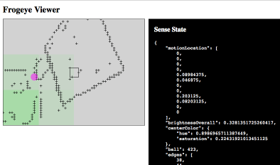

# frogeye.js

I discovered the seminal 1959 paper "[What a Frog's Eye Tells a Frog's Brain](http://neuromajor.ucr.edu/courses/WhatTheFrogsEyeTellsTheFrogsBrain.pdf)" in a [Nautilus article on Walter Pitts](http://nautil.us/issue/21/information/the-man-who-tried-to-redeem-the-world-with-logic)

Mind == Blown.

Not only was Walter a fascinating person, but the results of the frog eye study jibed with [my own work on AI](http://behaviorallogic.com/foundation). The powerful simplicity of image processing in a frog's retina inspired me to attempt to build a simulation.

## What Does a Frog's Eye Tell a Frog's Brain?

The gist of the paper is that most people probably think that the eye works like a camera:

Light-sensitive cells send a "picture" back to the brain to be analyzed. But when anatomists first dissected vertebrate eyeballs, the structure of the retina was more like this:

There was an intermediate layer of cells between the light-detecting ones and the optic nerves. What were these doing? [Jerome Lettvin](https://www.technologyreview.com/s/508376/in-a-frogs-eye/)'s experiment was designed to find out. He recorded the signals from electrodes in the nerves of the different intermediate cells while he showed pictures to the frogs.

What he discovered was that this middle layer of cells was doing significant visual processing. Among the types of visual analysis found were:

* On/off - These cells signal if something in an area changes from light to dark or dark to light (signifying movement.)
* Dimming - These cells fire when a large portion of the visible area suddenly gets darker.
* Contrast - These cells recognize edges.
* "Bug" - These cells send a signal when a small, round, moving object enters the field of view.

The frog's brain didn't need to makes sense of the world at all. The intermediate retinal cells were handling this in a very hard-wired way.

This looks nothing like a neural net. Co-author Walter Pitts was arguably the father of neural networks. After the frog paper was published he burned all of his work and drank himself to death.

## Implemented So Far

I decided to try to simulate on/off (movement) cells using a Raspberry Pi first. The file *[motion-overall.js](https://github.com/chrisbroski/frogeye/blob/master/motion-overall.js)* is a simple processor to measure total movement in the field of vision of a Pi camera.

The files *viewerserver.js* and *viewer.html* were built to make monitoring the visual processors easier and more fun. The server broadcasts perception data to the HTML page using the [Socket.io](http://socket.io/) library. The viewer displays raw perception data numerically and visually.

*Senses.js* is a module designed to organize all of the sensory processing of an intelligent artifact. It is built according to [my AI architecture](http://behaviorallogic.com/api/spec) to have 4 main sections:

1. **Observers** to collect raw sensory data
2. **Perceivers** to analyze raw observer data
3. **Attention** to control when observers and perceivers are active
4. **Sense State** to organize and share perception information

The *frogeye.js* module currently detects:

1. Primary motion direction (left, center, right, or none)
2. Motion location in a 4 x 3 grid
3. Overall brightness of the visual field
4. Contrast in one of 3,072 points (64 x 48 grid)

The viewer shows visualizations of this data in a 400 x 300 display:

1. Red arrows or a dot indicate primary motion direction
2. Translucent green squares represent motion location
3. Background color is proportional to overall brightness
4. Plus signs (\+) for areas of contrast

## Hardware

I am using a [Raspberry Pi 2 B](https://www.raspberrypi.org/products/raspberry-pi-2-model-b/) running Raspbian Jessie and a [Raspberry Pi Camera](https://www.raspberrypi.org/products/camera-module/). I am writing the code on a Mac connected to the Pi over ssh.

## Software

### Node.js

Why Node.js? AI programming decades ago was done with high-level languages that utilized functional and declarative programming paradigms. So what are using today? C and Java? What a giant step backward. If we are ever going to make AI programming a practical endeavor, we need to use development tools with abstraction power. What is the best AI programming language today? I doubt any are as good as they could be, but in my opinion based on limited experience: [Erlang OTP](http://erlang.org/doc/) looks promising. A Lisp dialect like [Scheme](http://www.schemers.org/) could be useful. [Python](https://www.python.org/) is adequate and JavaScript is OK. I am not a fan of JavaScript's C-like syntax (curly brace and semicolon litter everywhere) but it implements a lot of functional paradigms and has a great native data structure (JSON or JavaScript Object Notation.)

Another thing JavaScript has going for it is that it is currently one of the most popular languages in the world (though for UI development, not AI) so at least budding AI programmers don't have to scale the learning curve of something like Erlang. A few years ago Node.js took the JavaScript engine out of the front-end to build a network application development tool. Node.js improved some of the major warts of front-end JavaScript (notably library module inclusion) and introduced a great way to find and manage libraries: npm - the Node Package Manager. Node.js is a powerful network development tool, allowing for the building of distributed communication systems similar to (but not quite as good as) OTP.

I am not the only one to use JavaScript for AI and robotics. There is an active community of JavaScript robot enthusiasts called [NodeBots](http://nodebots.io/).

I recommend getting started using Node.js on the Raspberry Pi with this [AdaFruit tutorial](https://learn.adafruit.com/node-embedded-development/installing-node-dot-js) except don't install it like they do. Apt-get packages for Node.js are way out of date. I have found that [n for Node.js version management](https://github.com/tj/n) works well to install current versions of Node.js on the Raspberry Pi.

### [Atom.io](http://atom.io/)

I am using GitHub's Atom.io code editor on Mac to write the JavaScript. I recommend the [remote-atom](https://atom.io/packages/remote-atom) plugin to easily sync the code files to the Raspberry Pi.

## Performance

If you are curious about how much this visual processing in Node.js asks of your hardware resources, I checked. The *viewserver.js* process (which imports *Senses.js* which imports *frogeye.js*) puts my Raspberry Pi 2 at about 4.0% Cpu with negligible RAM usage. This is at a time lapse camera setting of 0 (take pictures as fast as possible, minimum 30ms) and sending sense data to the client every 20ms (50 times per second.) Here's the top output if you don't believe me.

The view client runs on a different machine so its usage is not reflected in the above data.

### Reverse-Engineering the Y'UV Image Format

The Raspberry Pi camera can output uncompressed files in [Y'UV format](https://en.wikipedia.org/wiki/YUV) (or YUV or YCbCr) that are easier to analyze than JPEGs, once you know what all the ones and zeros mean. I had some fun using [Hex Fiend](http://ridiculousfish.com/hexfiend/) to edit the raw files, then converted them to JPEG with [ImageMagick](http://www.imagemagick.org/script/index.php) with this command:

    convert -size "64x48" -depth 8 yuv:test.raw conv.jpg

Then used Apple Preview to see how I mangled the picture.

#### Summary of Y'UV

I am using a 64 pixel wide by 48 pixel high image, so let's assume that for my examples. This generates a file 4608 bytes in size (1.5 * 64 * 48) where the first 2/3 is a simple black-and-white bitmap and the last 1/3 is color information. How it stores the image dimensions is a mystery. Magic maybe?

##### Y Component

The first part of the binary data of a `raspiyuv` capture is 3072 (64 x 48) 8-bit values (0x00 - 0xFF, or 0 - 255 in decimal) that represent the Y, or luma, component of the image where 0x00 is the darkest and 0xFF is the brightest value. This is what I am using for most of the image analysis.

##### UV Component

https://en.wikipedia.org/wiki/YUV#/media/File:YUV_UV_plane.svg

